# 🛒 E-Cart Analytics: Modernización hacia un Data Lakehouse en Databricks

> **Propósito del Proyecto:** Este repositorio resuelve el caso de negocio *"Modernización de la Plataforma de Datos - E-Cart Analytics"*. Su objetivo principal es migrar la carga analítica de una base de datos transaccional (PostgreSQL) que estaba sufriendo problemas de rendimiento, hacia una arquitectura moderna, escalable y gobernada en la nube utilizando **AWS** y **Databricks Unity Catalog**.

---

## 📖 1. Contexto del Negocio (Para perfiles no técnicos)

**El Problema Original:**
La empresa "E-Cart" operaba todo su comercio electrónico sobre una base de datos PostgreSQL. Con el rápido crecimiento de la empresa, los equipos de negocio (Finanzas y Marketing) comenzaron a ejecutar reportes pesados directamente sobre esta base de datos transaccional. Esto causaba caídas del sistema, enlentecía la aplicación para los usuarios finales y no permitía hacer análisis predictivos.

**La Solución:**
Diseñar un **Data Lakehouse**. Extraer la información desde PostgreSQL sin afectar su rendimiento y llevarla a la nube (AWS S3). Una vez allí, utilizar el poder de procesamiento distribuido de **Databricks (Apache Spark)** para limpiar, transformar y organizar los datos, preparándolos para ser consumidos por tableros estadísticos (Power BI, Tableau) de manera súper rápida e independiente de la aplicación principal.


### 🚀 Extra Mile: De un concepto teórico a una plataforma funcional
El reto pedía *diseñar e implementar conceptualmente* la solución. Sin embargo, para demostrar habilidades de ingeniería reales, **este repositorio contiene un pipeline 100% funcional**. 
Como no se proveyeron datos de prueba, se desarrolló un simulador avanzado en Python (`bronze/generate_dummy_data.py`) utilizando la librería `Faker` para generar decenas de miles de registros sintéticos (con nombres latinos, correos y transacciones coherentes), permitiendo probar la ingesta y transformación en un entorno de Big Data realista.

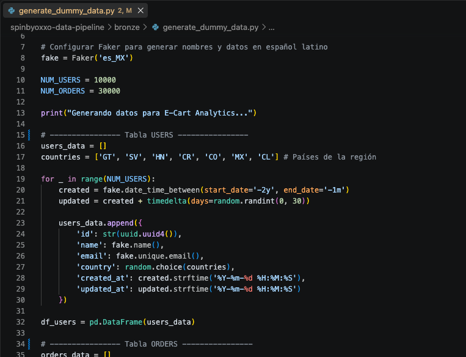
*Script generador de datos transaccionales, creando perfiles de usuarios realistas para alimentar la capa Bronze y probar el rendimiento del pipeline.*


---

## 🏗️ 2. Arquitectura de la Solución (End-to-End)

El flujo de datos implementado sigue el estándar de la industria conocido como **Arquitectura Medallion**, dividiendo los datos en tres capas de pureza:

- 🥉 **Capa Bronze (Datos Crudos):** Almacena los archivos exactos como llegaron de las fuentes transaccionales (`users`, `orders`, `order_items`). Es un respaldo inmutable histórico.
- 🥈 **Capa Silver (Datos Limpios):** Aquí la data cobra sentido comercial. Se tipifican las columnas, se eliminan registros corruptos y, **muy importante**, se encriptan (enmascaran) los datos personales de los clientes (PII) para cumplir con leyes de privacidad de datos.
- 🥇 **Capa Gold (Modelos de Negocio):** Los datos limpios se cruzan y consolidan en modelos para el negocio (*Star Schema*). Aquí nacen las tablas que usarán los analistas (ej. `dim_users` y `fct_sales`).

### Diagrama General de Arquitectura Cloud

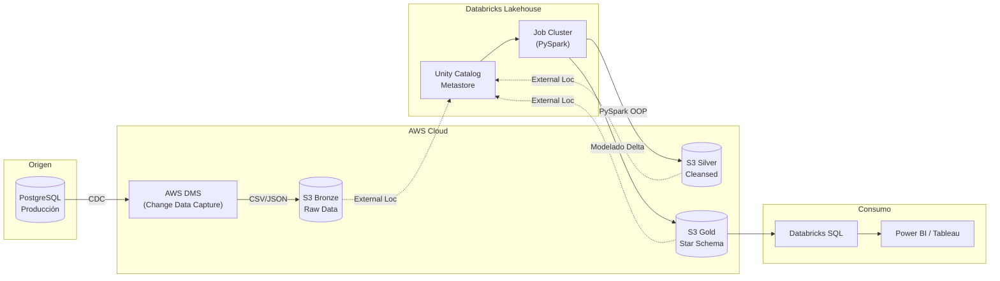

---

## 🛡️ 3. Gobernanza, Privacidad y Seguridad

Este proyecto fue diseñado con la seguridad en primer plano, no como una idea de último momento:

1. **Protección de Datos Personales (PII):** Durante la transformación en la capa Silver (`st_users`), los correos electrónicos de los usuarios son encriptados mediante un algoritmo criptográfico de una sola vía (**SHA-256**). Esto permite a los analistas saber que es un usuario único, pero no pueden ver su correo real.
2. **Databricks Unity Catalog:** Actúa como el gran "gobernante" de los datos. Unity Catalog vincula las carpetas físicas de S3 con Databricks, permitiendo gestionar permisos a nivel de tablas, esquemas e incluso columnas.

### 🔐 Gestión de Accesos (AWS IAM Roles)

La arquitectura sigue el principio de **menor privilegio**, aislando las responsabilidades en diferentes Roles de IAM administrados por Terraform (todos prefijados con `spinbyoxxo-` para fácil identificación en tu consola de AWS):

- **Cross-Account Role** (`spinbyoxxo-databricks-cross-account-role`): Permite al plano de control global de Databricks instanciar clústeres EC2 (las máquinas virtuales que ejecutan Spark) en tu VPC de AWS de manera segura usando `External ID`.
- **UC Metastore Access Role** (`spinbyoxxo-uc-access`): Rol exclusivo para que el Metastore de Unity Catalog pueda administrar sus metadatos internos en su bucket S3 dedicado (`spinbyoxxo-databricks-metastore-...`).
- **UC Storage Credentials Role** (`spinbyoxxo-uc-storage-role`): Rol crítico que cuenta con políticas `self-assuming` estrictas. Es utilizado por Databricks para leer y escribir los datos reales directamente en los Data Lakes (los buckets Bronze, Silver y Gold).

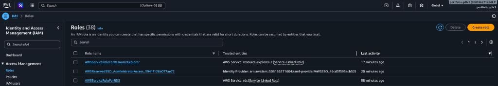
*Políticas de IAM aprovisionadas desde código, garantizando la seguridad entre cuentas (Cross-Account). Nota: En tu consola verás roles nativos de AWS (como AWSServiceRoleForRDS), pero los roles de esta arquitectura siempre inician con el prefijo del proyecto.*

3. **Formato Delta Lake:** Todas las tablas de las capas Silver y Gold se guardan nativamente en formato **Delta**. Esto permite a la empresa hacer "viajes en el tiempo" (recuperar datos borrados) y asegura que, si un proceso de transformación falla a la mitad, los datos no se corrompan (transacciones ACID).

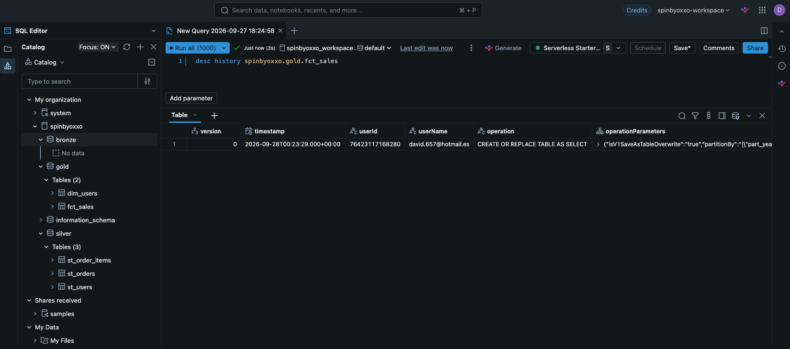
*Demostración de las capacidades transaccionales de Delta Lake (<code>DESC HISTORY</code>), mostrando el registro de auditoría de quién y cómo se modificó la tabla.*

### Almacenamiento Físico en AWS S3

Aunque los analistas interactúan con tablas en Databricks, los datos reales residen de manera segura en tu propia cuenta de AWS. Unity Catalog abstrae la complejidad organizando los archivos transaccionales (`.parquet` y `_delta_log`) bajo identificadores únicos (UUIDs).

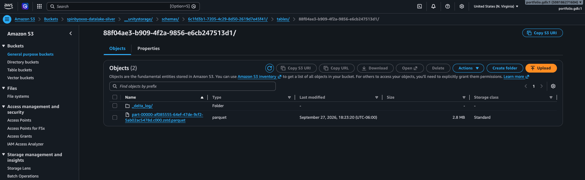
*Almacenamiento nativo de las tablas Delta dentro del bucket S3 (Capa Silver), administrado y gobernado transparentemente por Unity Catalog.*

### Diseño de Datos (Capa Silver)

En la capa Silver los datos se limpian, enmascaran y tipifican, pero conservan la estructura transaccional original antes del modelado analítico:

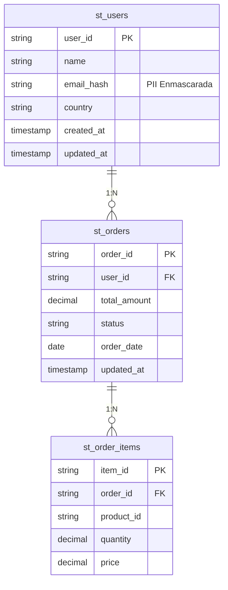

### Diseño del Modelo de Datos (Capa Gold)

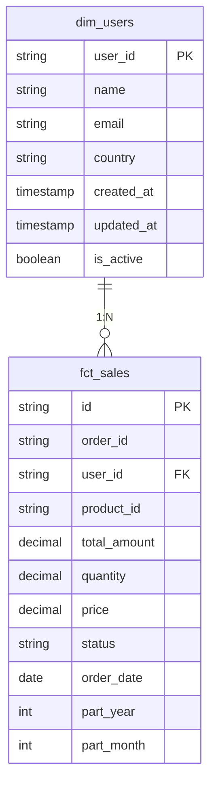

*(La tabla `fct_sales` está particionada físicamente en el almacenamiento en la nube por `part_year` y `part_month` para acelerar drásticamente los reportes que buscan ventanas de tiempo específicas).*

> **SCD Tipo 2 (Slowly Changing Dimensions):** Como se aprecia en la tabla `dim_users`, se implementó el campo `is_active` (booleano). Esto prepara el modelo de datos para retener el historial completo de cambios de un usuario (por ejemplo, si cambia de país). Cuando un dato cambia, el registro antiguo se marca como inactivo (`is_active = False`) y se inserta el nuevo como activo, permitiendo que las ventas históricas de `fct_sales` apunten siempre a la fotografía correcta del usuario en el momento de la compra.


---

## ⚙️ 4. Ingeniería Híbrida: Código Limpio y Escalable

El código de transformación no es un script gigante difícil de leer. Fue diseñado combinando **Programación Orientada a Objetos (OOP)** y **Jupyter Notebooks**, logrando lo mejor de ambos mundos:

- **La Clase Maestra (`src/etl_master.py`):** Contiene la lógica dura y repetitiva. Se encarga de extraer, cargar en formato Delta y particionar, todo leyendo desde el `config.yaml`.
- **Los Notebooks Analíticos (`silver/*.ipynb`, `gold/*.ipynb`):** Cada tabla del negocio tiene su propio Notebook. Estos heredan de la clase maestra, por lo que su código es extremadamente limpio (solo declaran cómo se transforma el dato). Al ser Notebooks, los analistas de datos en la nube pueden abrirlos visualmente en Databricks y explorar las celdas sin tener que entender arquitecturas complejas de software.
- **Configuración Dinámica (`conf/config.yaml`):** Una sola "consola de mandos" que enciende, apaga o redirige tablas completas con cambiar una sola palabra, sin tocar el código fuente de Python.

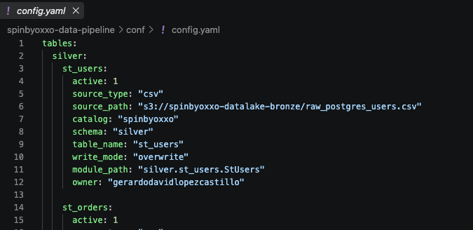
*Un solo archivo YAML controla toda la orquestación: metadatos, esquemas (Silver/Gold), ubicaciones y modos de escritura.*

---

## 🚀 5. Infraestructura como Código (Terraform)

Crear recursos de manera manual en Amazon Web Services (AWS) dando clics es una mala práctica propensa a errores humanos. Este proyecto cuenta con la carpeta `infrastructure/terraform/`, donde toda la infraestructura está automatizada en código.
Con un solo comando (`terraform apply`), la nube crea de forma idéntica y segura:
- La red virtual (VPC, Subredes).
- Los contenedores S3 de almacenamiento.
- Los Permisos y Roles (IAM).
- El Workspace de Databricks y Unity Catalog.

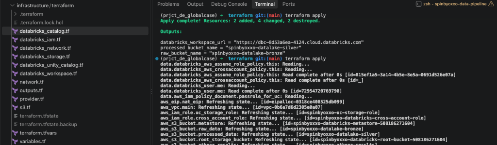
*Despliegue de los recursos ejecutando `terraform apply` desde la terminal integrada, mostrando la organización modular de los archivos `.tf`.*

> **Nota Técnica de Optimización:** En iteraciones previas se probaron tecnologías antiguas (AWS Redshift, AWS ECS Fargate, ECR Docker). Al migrar a Databricks, se depuraron y destruyeron todos esos recursos obsoletos, demostrando un enfoque **FinOps** (optimización de costos) para no dejar infraestructura fantasma consumiendo presupuesto.

---

## ▶️ 6. Guía de Ejecución Rápida

La mayor ventaja de esta arquitectura es su **Modelo Dual**. Puedes probar tu código localmente sin gastar dinero en la nube, y luego subir el mismo código a producción sin modificar una sola línea.

### A) Ejecución Local (Para Desarrolladores / Pruebas)

1. Instala el entorno virtual con las dependencias:
   ```bash
   pip install -r requirements.txt
   ```
2. Ejecuta el orquestador principal con la bandera de pruebas:
   ```bash
   python main.py --onpremise
   ```
   **¿Qué hace la bandera `--onpremise`?** Intercepta la configuración, simula la existencia de Unity Catalog dentro de tu computadora creando la base de datos `spark-warehouse`, y lee los CSV locales en la carpeta `bronze/` en lugar de ir a buscarlos al S3 de AWS.

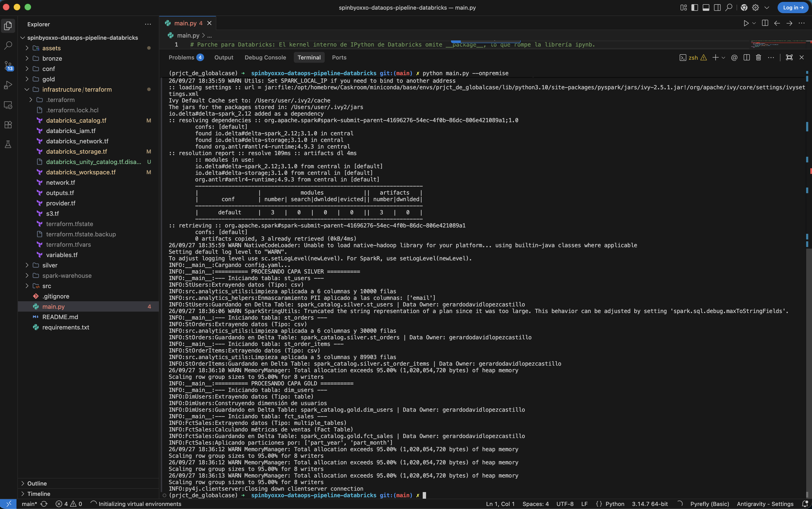
*Ejecución exitosa del pipeline de manera local mediante el flag --onpremise, simulando las escrituras en una base de datos local embebida.*

### B) Ejecución en Databricks (Cloud Producción)

1. En tu espacio de trabajo (Workspace) de Databricks, usa la función **Databricks Repos (Git Folders)** para conectar este repositorio de GitHub.
2. Databricks clonará el proyecto idéntico a la nube.

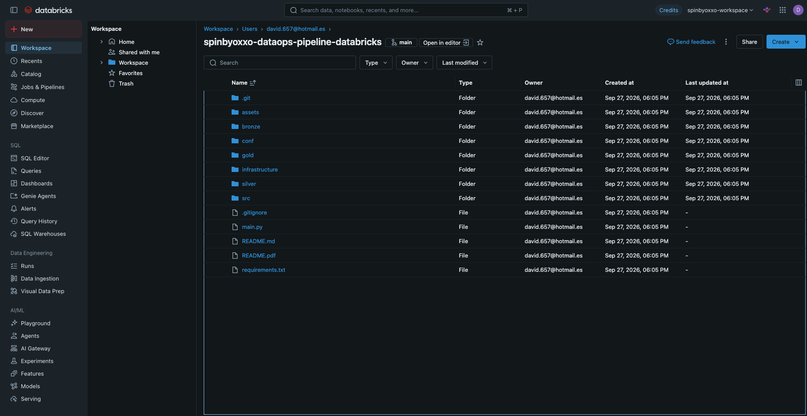
*Workspace de Databricks sincronizado con el repositorio de GitHub de manera nativa para CI/CD continuo.*

3. Dirígete a la pestaña **Workflows -> Create Job**.
4. Crea una tarea de tipo **Python Script** apuntando al archivo `main.py` de tu repositorio recién sincronizado.
5. En la configuración del Clúster del Job, asegúrate de instalar las librerías `omegaconf` y `ipynb`.

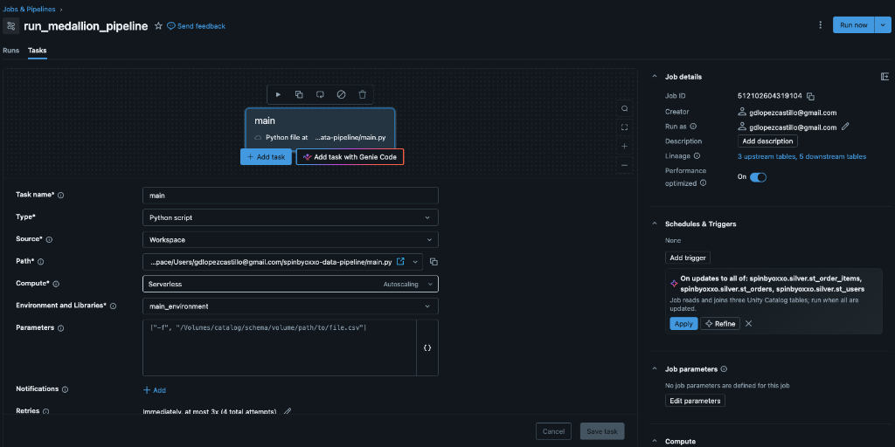
*Configuración de la tarea en Databricks Workflows apuntando al script principal y definiendo los parámetros de cómputo serverless.*

6. Presiona **Run Now**. Al no enviar la bandera `--onpremise`, el script utilizará los recursos empresariales: leerá los terabytes de datos en AWS S3 y guardará las tablas en Unity Catalog.

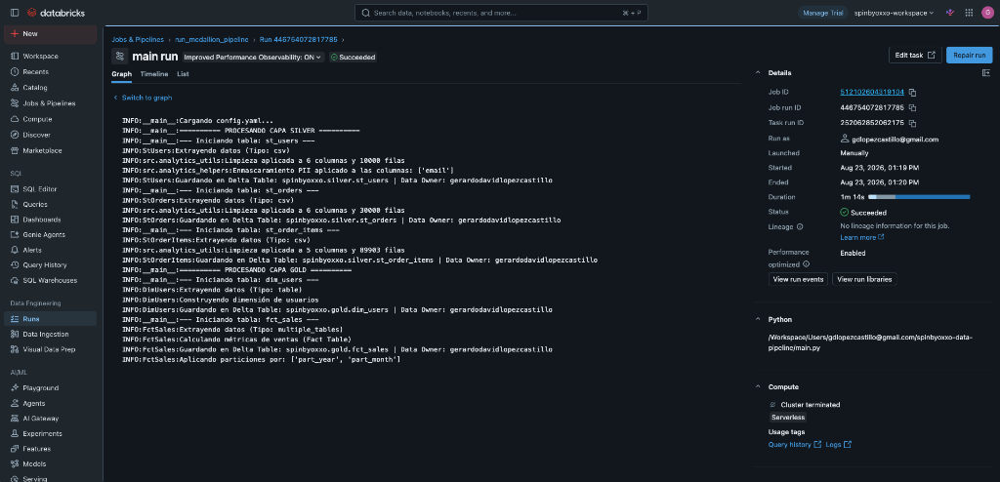
*Ejecución 100% exitosa del pipeline completo orquestado mediante un Job Cluster automatizado.*

### 📊 Consumo de Datos (Databricks SQL)

Una vez completado el pipeline, la arquitectura permite de manera instantánea realizar analítica de datos utilizando Databricks SQL Editor o conectándolo con herramientas de BI (PowerBI, Tableau, etc.).

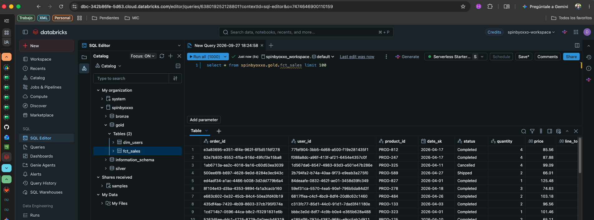
*Consulta de las tablas de negocio finales de la capa Gold utilizando Databricks SQL Engine.*


---

## 🎯 7. Defensa de Decisiones Técnicas (Respuestas al Caso de Negocio)

Como parte de la sustentación técnica de esta arquitectura, a continuación se detallan las respuestas a los requerimientos de negocio planteados:

### 1. Ingesta: ¿Batch o Streaming (CDC)? ¿Cómo mitigar el impacto en Producción?
**Decisión:** Se implementa un enfoque de **Change Data Capture (CDC)** mediante **AWS DMS (Database Migration Service)**. 
**Justificación:** Al ser una base de datos OLTP (PostgreSQL) crítica para la app móvil, realizar consultas masivas tipo `SELECT *` para extracciones Batch en horas pico degradaría el servicio. AWS DMS lee directamente de los *Write-Ahead Logs (WAL)* de PostgreSQL, extrayendo los cambios (Inserts/Updates/Deletes) en tiempo real con un impacto casi nulo en el rendimiento de la base de datos origen. Estos eventos aterrizan como archivos crudos inmutables en la capa **Bronze** (S3).

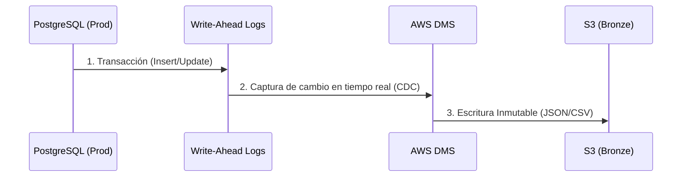


### 2. ¿Cómo asegurar que los datos sensibles (PII) estén protegidos?
**Decisión:** Enmascaramiento criptográfico y aislamiento de permisos.
**Justificación:** Durante el salto de la capa Bronze a la capa Silver (ver `src/analytics_helpers.py`), los campos como el `email` de los usuarios pasan por una función Hash unidireccional (**SHA-256**). De esta forma, el dato original se destruye para los analistas, pero permite seguir trazando la identidad del usuario (ej. para saber cuántas compras hizo). Adicionalmente, el acceso a la capa Bronze queda estrictamente prohibido para analistas a través de **Unity Catalog**, permitiendo solo a roles de Ingeniería ver el dato crudo.
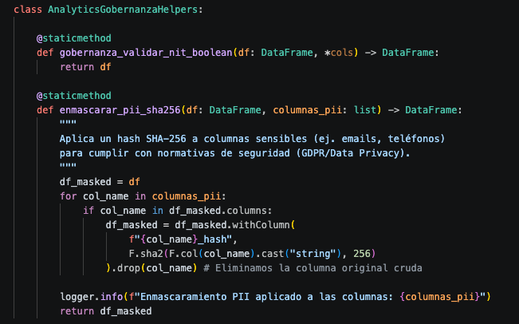
*Fragmento de código en PySpark mostrando la función SHA-256 aplicada a columnas dinámicas configuradas.*

### 3. Estrategia de particionamiento para tablas de hechos (Fact Tables)
**Decisión:** Particionamiento físico por `part_year` y `part_month`.
**Justificación:** El comercio electrónico genera un volumen masivo de transacciones. En la capa Gold, la tabla `fct_sales` está particionada por año y mes. Cuando un analista financiero ejecute reportes como *"Ventas totales en el último trimestre"*, el motor de Databricks SQL ignorará el 90% de los datos históricos irrelevantes (Partition Pruning), leyendo solo los meses necesarios. Esto ahorra tiempos de cómputo y costos drásticamente.
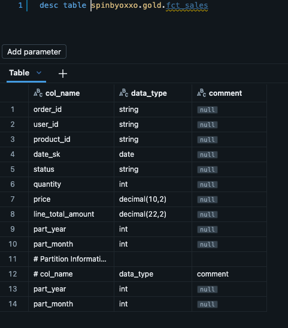
*Descripción de la tabla fct_sales en Unity Catalog confirmando que los datos están particionados por año y mes.*

### 4. Cambios de estado (ej. Pending a Completed): ¿Cómo se refleja en la arquitectura?
**Decisión:** Operaciones `UPSERT` gracias a las propiedades ACID de Delta Lake.
**Justificación:** En un Data Lake tradicional (solo Parquet), actualizar un registro es extremadamente ineficiente (requiere reescribir todo el archivo). Como usamos **Delta Lake** en las capas Silver y Gold, podemos utilizar la operación `MERGE INTO`. Cuando el CDC captura que una orden cambió a `Completed`, Spark ejecuta un *Upsert* sobre la tabla Delta: si el ID de la orden existe, actualiza el estado; si no existe, la inserta. Así, los dashboards siempre reflejan el estado real sin duplicar registros.

### 5. ¿Qué framework de CI/CD implementarías y cómo manejarías IaC?
**Decisión (Diseño Teórico):** **GitHub Actions** orquestando **Terraform** y Databricks CLI.
**Justificación:**
Dado que este proyecto ya cuenta con el código de IaC y Pipelines, la evolución natural empresarial (no implementada en el código actual, pero diseñada) se divide en dos fases:

**Integración Continua (CI):**
- Al hacer un Pull Request hacia `main`, un Workflow de GitHub Actions ejecutará un linter (ej. `flake8`) y tests unitarios locales (ej. usando `pytest` llamando a `main.py --onpremise`).
- Se ejecutará `terraform plan` para evaluar qué infraestructura va a cambiar en AWS/Databricks, entregando el plan como un comentario en el PR para revisión manual.

**Despliegue Continuo (CD):**
- Al hacer merge a la rama `main`, un job ejecuta `terraform apply -auto-approve` creando o modificando recursos (S3, IAM, Unity Catalog).
- Posteriormente, a través de la API de Databricks, se dispara una actualización al *Git Repo* del Workspace para sincronizar el código PySpark.
- Finalmente, se despliegan/actualizan los *Databricks Workflows (Jobs)* usando Databricks Asset Bundles (DABs) o Terraform, asegurando que la infraestructura y el código estén siempre alineados.

---
<div align="center">
  <h3><b>Gerardo López</b></h3>
  <p>Senior Data Engineer | Data Architect | Cloud Engineer</p>

<div align="center">
  <a href="https://linktr.ee/gdlopezcastillo" target="_blank">
    
  </a>
  <a href="https://www.linkedin.com/in/gdlopezcastillo/" target="_blank">
    
  </a>
  <a href="mailto:gdlopezcastillo@gmail.com">
    
  </a>
  <a href="https://github.com/gerardodavidlopezcastillo" target="_blank">
    
  </a>
</div>
