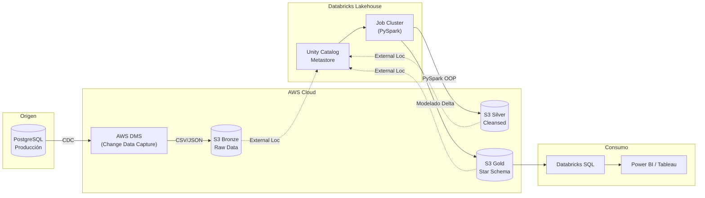
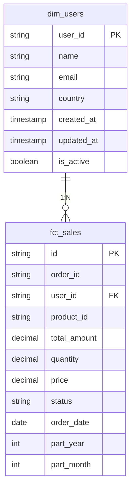

# 🛒 E-Cart Analytics: Modernización hacia un Data Lakehouse en Databricks

> **Propósito del Proyecto:** Este repositorio resuelve el caso de negocio *"Modernización de la Plataforma de Datos - E-Cart Analytics"*. Su objetivo principal es migrar la carga analítica de una base de datos transaccional (PostgreSQL) que estaba sufriendo problemas de rendimiento, hacia una arquitectura moderna, escalable y gobernada en la nube utilizando **AWS** y **Databricks Unity Catalog**.

---

## 📖 1. Contexto del Negocio (Para perfiles no técnicos)

**El Problema Original:**
La empresa "E-Cart" operaba todo su comercio electrónico sobre una base de datos PostgreSQL. Con el rápido crecimiento de la empresa, los equipos de negocio (Finanzas y Marketing) comenzaron a ejecutar reportes pesados directamente sobre esta base de datos transaccional. Esto causaba caídas del sistema, enlentecía la aplicación para los usuarios finales y no permitía hacer análisis predictivos.

**La Solución:**
Diseñar un **Data Lakehouse**. Extraer la información desde PostgreSQL sin afectar su rendimiento y llevarla a la nube (AWS S3). Una vez allí, utilizar el poder de procesamiento distribuido de **Databricks (Apache Spark)** para limpiar, transformar y organizar los datos, preparándolos para ser consumidos por tableros estadísticos (Power BI, Tableau) de manera súper rápida e independiente de la aplicación principal.

---

## 🏗️ 2. Arquitectura de la Solución (End-to-End)

El flujo de datos implementado sigue el estándar de la industria conocido como **Arquitectura Medallion**, dividiendo los datos en tres capas de pureza:

- 🥉 **Capa Bronze (Datos Crudos):** Almacena los archivos exactos como llegaron de las fuentes transaccionales (`users`, `orders`, `order_items`). Es un respaldo inmutable histórico.
- 🥈 **Capa Silver (Datos Limpios):** Aquí la data cobra sentido comercial. Se tipifican las columnas, se eliminan registros corruptos y, **muy importante**, se encriptan (enmascaran) los datos personales de los clientes (PII) para cumplir con leyes de privacidad de datos.
- 🥇 **Capa Gold (Modelos de Negocio):** Los datos limpios se cruzan y consolidan en modelos para el negocio (*Star Schema*). Aquí nacen las tablas que usarán los analistas (ej. `dim_users` y `fct_sales`).

### Diagrama General de Arquitectura Cloud



---

## 🛡️ 3. Gobernanza, Privacidad y Seguridad

Este proyecto fue diseñado con la seguridad en primer plano, no como una idea de último momento:

1. **Protección de Datos Personales (PII):** Durante la transformación en la capa Silver (`st_users`), los correos electrónicos de los usuarios son encriptados mediante un algoritmo criptográfico de una sola vía (**SHA-256**). Esto permite a los analistas saber que es un usuario único, pero no pueden ver su correo real.
2. **Databricks Unity Catalog:** Actúa como el gran "gobernante" de los datos. Unity Catalog vincula las carpetas físicas de S3 con Databricks, permitiendo gestionar permisos a nivel de tablas, esquemas e incluso columnas.
3. **Formato Delta Lake:** Todas las tablas de las capas Silver y Gold se guardan nativamente en formato **Delta**. Esto permite a la empresa hacer "viajes en el tiempo" (recuperar datos borrados) y asegura que, si un proceso de transformación falla a la mitad, los datos no se corrompan (transacciones ACID).

### Diseño del Modelo de Datos (Capa Gold)


*(La tabla `fct_sales` está particionada físicamente en el almacenamiento en la nube por `part_year` y `part_month` para acelerar drásticamente los reportes que buscan ventanas de tiempo específicas).*

---

## ⚙️ 4. Ingeniería Híbrida: Código Limpio y Escalable

El código de transformación no es un script gigante difícil de leer. Fue diseñado combinando **Programación Orientada a Objetos (OOP)** y **Jupyter Notebooks**, logrando lo mejor de ambos mundos:

- **La Clase Maestra (`src/etl_master.py`):** Contiene la lógica dura y repetitiva. Se encarga de extraer, cargar en formato Delta y particionar, todo leyendo desde el `config.yaml`.
- **Los Notebooks Analíticos (`silver/*.ipynb`, `gold/*.ipynb`):** Cada tabla del negocio tiene su propio Notebook. Estos heredan de la clase maestra, por lo que su código es extremadamente limpio (solo declaran cómo se transforma el dato). Al ser Notebooks, los analistas de datos en la nube pueden abrirlos visualmente en Databricks y explorar las celdas sin tener que entender arquitecturas complejas de software.
- **Configuración Dinámica (`conf/config.yaml`):** Una sola "consola de mandos" que enciende, apaga o redirige tablas completas con cambiar una sola palabra, sin tocar el código fuente de Python.

---

## 🚀 5. Infraestructura como Código (Terraform)

Crear recursos de manera manual en Amazon Web Services (AWS) dando clics es una mala práctica propensa a errores humanos. Este proyecto cuenta con la carpeta `infrastructure/terraform/`, donde toda la infraestructura está automatizada en código.

Con un solo comando (`terraform apply`), la nube crea de forma idéntica y segura:
- La red virtual (VPC, Subredes).
- Los contenedores S3 de almacenamiento.
- Los Permisos y Roles (IAM).
- El Workspace de Databricks y Unity Catalog.

> **Nota Técnica de Optimización:** En iteraciones previas se probaron tecnologías antiguas (AWS Redshift, AWS ECS Fargate, ECR Docker). Al migrar a Databricks, se depuraron y destruyeron todos esos recursos obsoletos, demostrando un enfoque **FinOps** (optimización de costos) para no dejar infraestructura fantasma consumiendo presupuesto.

---

## ▶️ 6. Guía de Ejecución Rápida

La mayor ventaja de esta arquitectura es su **Modelo Dual**. Puedes probar tu código localmente sin gastar dinero en la nube, y luego subir el mismo código a producción sin modificar una sola línea.

### A) Ejecución Local (Para Desarrolladores / Pruebas)

1. Instala el entorno virtual con las dependencias:
   ```bash
   pip install -r requirements.txt
   ```
2. Ejecuta el orquestador principal con la bandera de pruebas:
   ```bash
   python main.py --onpremise
   ```
   **¿Qué hace la bandera `--onpremise`?** Intercepta la configuración, simula la existencia de Unity Catalog dentro de tu computadora creando la base de datos `spark-warehouse`, y lee los CSV locales en la carpeta `bronze/` en lugar de ir a buscarlos al S3 de AWS.

### B) Ejecución en Databricks (Cloud Producción)

1. En tu espacio de trabajo (Workspace) de Databricks, usa la función **Databricks Repos (Git Folders)** para conectar este repositorio de GitHub.
2. Databricks clonará el proyecto idéntico a la nube.
3. Dirígete a la pestaña **Workflows -> Create Job**.
4. Crea una tarea de tipo **Python Script** apuntando al archivo `main.py` de tu repositorio recién sincronizado.
5. En la configuración del Clúster del Job, asegúrate de instalar las librerías `omegaconf` y `ipynb`.
6. Presiona **Run Now**. Al no enviar la bandera `--onpremise`, el script utilizará los recursos empresariales: leerá los terabytes de datos en AWS S3 y guardará las tablas en Unity Catalog.

---
<div align="center">
  <h3><b>Gerardo López</b></h3>
  <p>Senior Data Engineer | Data Architect | Cloud Engineer</p>

<div align="center">
  <a href="https://linktr.ee/gdlopezcastillo" target="_blank">
    
  </a>
  <a href="https://www.linkedin.com/in/gdlopezcastillo/" target="_blank">
    
  </a>
  <a href="mailto:gdlopezcastillo@gmail.com">
    
  </a>
  <a href="https://github.com/gerardodavidlopezcastillo" target="_blank">
    
  </a>
</div>
